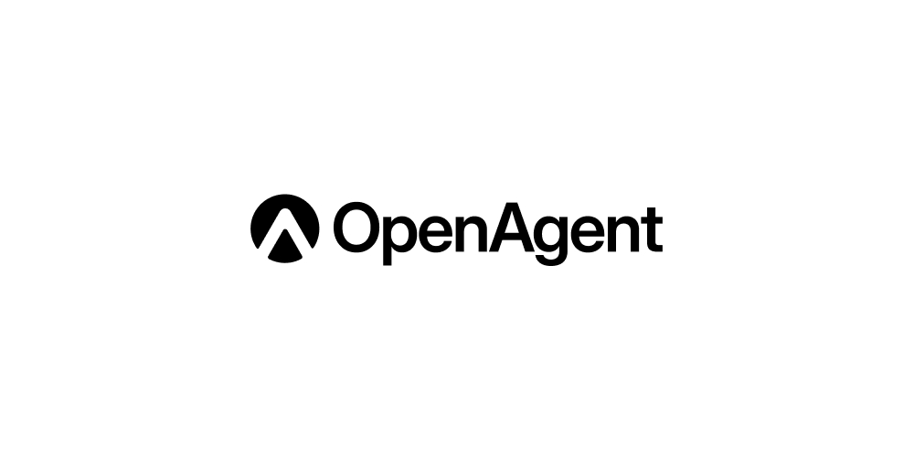

[](https://github.com/AFK-surf/open-agent/stargazers) &ensp;
[](https://opensource.org/licenses/Apache-2.0) &ensp;
[](https://discord.gg/your-discord-invite)
[](http://open-agent.io)

# 👋 Open-Agent

> **Open-source alternative to Claude Agent SDK, ChatGPT Agents, and Manus.**

Agentic AI systems, such as Claude Agent SDK (Claude Code) or ChatGPT Agents, can perform meaningful real-world tasks by operating computers, browsers, and phones just like humans. Open source would enhance their capabilities.

[**Open-Agent.io**](http://open-agent.io/) is an open Agentic AI you can use or modify. Chat with cutting-edge models while our multi-agent system completes your tasks.

Play with it, deploy it, enhance it, or use it as the foundation for your next dedicated agent. We welcome all contributions.

<video src="https://github.com/user-attachments/assets/1e3b8610-ff3e-4042-b43e-0a5ac367ef93" width="100%"></video>

---

## ✨ Key Features

- **💡 Idea**  
  Have your own highly customizable Agentic AI that integrates OpenAI, Claude, Gemini, and open-source models to work together seamlessly!

- **💬 Stop prompt-chasing. Start decision-making**  
  Spec & context engineering give agents structure to plan, score, and surface options. You stay in control of the final call. Achieve more, struggle less.

- **🔔 Multi-agent collaboration**  
  Instead of chatting with a single AI, all the frontier models collaborate together to finish your task with our multi-agent framework.

- **🏠 Self-hostable**  
  Open source and free to modify.

---

## 🤝 Contributing

We welcome all contributions, ideas, and improvements!  
Open issues or pull requests — no bureaucracy, just collaboration.

Starting points: [How To Development](tools/public/dev.md)

Before submitting a PR, run code checks:

```bash
pre-commit run --all-files
```

---

## 🌐 Community

Join our community to connect with other developers, share feedback, and showcase your projects.

> [Discord →](https://discord.gg/k36Qf2T3)

---

## ⭐ Star History

[](https://star-history.com/#AFK-surf/open-agent&Date)

---

## 💙 Acknowledgements

Open-Agent builds upon the ideas of projects like  
[AFFiNE](<[https://github.com/browserbase/stagehand](https://github.com/toeverything/AFFiNE)>),  
and the broader open-source agentic AI community.

Special thanks to everyone advancing human–AI collaboration.

---

© 2025 Open-Agent Contributors.  
Licensed under [Apache 2.0](https://opensource.org/licenses/Apache-2.0).
