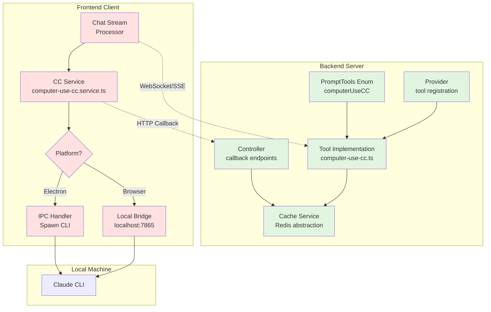

# Computer-Use-CC Tool Integration

## Overview

The Computer-Use-CC tool enables Open-Agent to execute Claude Code CLI commands on the user's local machine, providing powerful code development capabilities while maintaining security boundaries.

## Architecture

### Communication Flow

```mermaid
sequenceDiagram
    participant User
    participant Server as Open-Agent Server
    participant Cache as Redis Cache
    participant Client as Client (Browser/Electron)
    participant CLI as Claude Code CLI

    User->>Server: Chat request requiring code help
    Server->>Cache: Create task with unique ID
    Cache-->>Server: Task stored (TTL: 5min)
    Server->>Client: Stream tool request<br/>{type: 'computer-use-cc-request', taskId}

    Note over Server: Start polling cache<br/>(2s intervals, 2min timeout)

    Client->>Client: Detect tool request in stream
    Client->>CLI: spawn('claude', ['chat', ...])

    loop Streaming Output
        CLI-->>Client: stdout chunks
        Client accumulates stdout locally
        Server->>Cache: Update task with delta
    end

    CLI-->>Client: Process complete
    Client->>Server: POST /api/copilot/computer-use-cc/callback<br/>{taskId, status: 'completed', output}
    Server->>Cache: Update task status

    Server->>Cache: Poll: Get task result
    Cache-->>Server: Return completed task
    Server->>Cache: Delete task
    Server->>User: Return final result
```

### Component Diagram



### Key Components

#### Backend (Server-side)

- **Tool Definition**: `tools/computer-use-cc.ts`
  - Implements the tool using `createTool` helper
  - Manages task lifecycle with cache
  - Polls for results asynchronously (non-blocking)
- **Controller**: `computer-use-cc/controller.ts`
  - Handles callbacks from clients at `/api/copilot/computer-use-cc/callback`
  - (Streaming endpoint removed; client returns results via callback only)
  - Validates authentication and updates task status

- **Module**: `computer-use-cc/index.ts`
  - NestJS module for dependency injection
  - Imports CacheModule for task storage

- **Integration Points**:
  - Added `computerUseCC` to `PromptTools` enum in `providers/types.ts`
  - Added tool case in `providers/provider.ts` switch statement
  - Exported from `tools/index.ts`
  - Module imported in `copilot/index.ts`

#### Frontend (Client-side) - TODO

- **Service**: `frontend/app/src/services/computer-use-cc.service.ts`
  - Listens for tool requests in chat stream
  - Executes Claude Code via Electron IPC or local service
  - Posts results back to server

- **Electron Handler**: `frontend/electron/src/computer-use-cc/handler.ts`
  - Spawns Claude Code CLI process
  - Streams output incrementally
  - Handles errors and timeouts

## Implementation Status

### ✅ Completed

1. Added `computerUseCC` to PromptTools enum
2. Created tool implementation (`computer-use-cc.ts`)
3. Created controller for callbacks
4. Created and integrated ComputerUseCCModule
5. Integrated tool into provider switch statement
6. Exported tool from index

### 🚧 TODO - Frontend Implementation

1. Create frontend service to detect tool requests
2. Implement Electron IPC handler for CLI execution
3. Add browser support (local service bridge)
4. Implement streaming output support
5. Add error handling and retry logic
6. Create UI indicators for tool execution status

### 🧪 TODO - Testing

1. Unit tests for tool creation and cache operations
2. Integration tests for callback endpoints
3. E2E tests with mock Claude CLI
4. Performance tests for polling mechanism
5. Security tests for callback validation

## Security Considerations

### Current Implementation

- **Authentication Required**: All callback endpoints require auth
- **Cache TTL**: Tasks expire after 5 minutes
- **User Validation**: Tasks are associated with user context (TODO: enforce)

### Future Enhancements

1. **Task Ownership**: Validate user owns task before allowing updates
2. **Rate Limiting**: Prevent callback spam
3. **Signed Tokens**: Add cryptographic task validation
4. **Sandboxing**: Restrict file system access in Claude Code execution
5. **Audit Logging**: Track all tool executions

## Usage Example

When a user requests code development help, the agent can use the tool:

```typescript
// Server detects need for Claude Code
if (needsLocalCodeExecution) {
  tools: ['computerUseCC']
}

// Tool creates task and signals client
{
  type: 'computer-use-cc-request',
  taskId: 'abc-123',
  task: 'Fix the authentication bug in auth.service.ts',
  context_files: ['src/auth.service.ts'],
  working_directory: '/project'
}

// Client executes and callbacks
POST /api/copilot/computer-use-cc/callback
{
  taskId: 'abc-123',
  status: 'completed',
  output: 'Fixed authentication bug...'
}
```

## Technical Details

### Cache Keys

- Pattern: `computer-use-cc:{taskId}`
- TTL: 300 seconds (5 minutes)
- Structure:
  ```typescript
  {
    id: string;
    task: string;
    context_files?: string[];
    working_directory?: string;
    status: 'pending' | 'streaming' | 'completed' | 'failed';
    output?: string;
    error?: string;
    delta?: string; // for streaming
    createdAt: number;
    updatedAt?: number;
  }
  ```

### Polling Mechanism

- Interval: 2 seconds
- Timeout: 120 seconds (2 minutes)
- Non-blocking: Uses async/await with setTimeout
- Cleanup: Deletes task from cache on completion/failure/timeout

## Development Notes

### Running Locally

1. Ensure Redis is running for cache
2. Claude CLI must be installed on client machine
3. Set appropriate CORS headers for local development

### Debugging

- Check logs with tag `ComputerUseCCTool` and `ComputerUseCCController`
- Monitor Redis for task keys: `redis-cli KEYS "computer-use-cc:*"`
- Test callbacks manually: `curl -X POST localhost:3000/api/copilot/computer-use-cc/callback`

### Performance Considerations

- Polling adds ~2 second latency per check
- Cache operations are fast (< 1ms)
- Consider WebSocket for real-time updates in future

## Future Improvements

1. **WebSocket Support**: Replace polling with real-time bidirectional communication
2. **Task Queue**: Use proper job queue (Bull/BullMQ) for task management
3. **Progress Tracking**: Add progress percentage for long-running tasks
4. **Cancel Support**: Allow users to cancel running tasks
5. **Multi-file Context**: Better support for complex multi-file operations
6. **Result Caching**: Cache successful results for similar tasks
7. **Metrics**: Add telemetry for usage patterns and performance

## Related Files

- Browser-Use tool: `tools/browser-use.ts` (similar pattern)
- Python Sandbox: `tools/e2b-python-sandbox.ts` (external execution)
- Cache Service: `base/cache/` (abstraction layer)
- Auth Guards: `core/auth/` (security)
